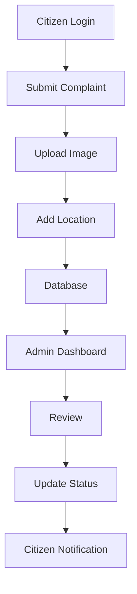

<div align="center">

# 🌍 Civic Care

### **Smart Civic Issue Reporting & Community Engagement Platform**


<br>


<br>

### 🚀 Empowering Citizens • Connecting Communities • Building Smarter Cities

</div>

---

# ✨ Overview

Civic Care is an intelligent web platform that enables citizens to report civic issues directly to authorities with complete transparency.

From reporting potholes and garbage dumps to tracking complaint resolution in real time, Civic Care creates a seamless digital bridge between citizens and government.

---

# 🎯 Problem Statement

Traditional complaint systems suffer from:

❌ Manual paperwork

❌ Slow response time

❌ No transparency

❌ No complaint tracking

❌ Poor communication

---

# 💡 Our Solution

✔ Digital Complaint Registration

✔ Real-Time Status Tracking

✔ Location-Based Reporting

✔ Image Upload Support

✔ Admin Dashboard

✔ Complaint Analytics

✔ Faster Resolution

---

# 🚀 Features

| 👤 Citizen | 🛠 Admin |
|------------|----------|
| Register/Login | Dashboard |
| Report Issues | View Complaints |
| Upload Images | Update Status |
| GPS Location | Manage Users |
| Track Complaints | Analytics |
| Complaint History | Priority Handling |

---

# 🌟 Core Features

### 📍 Smart Complaint Reporting

- Image Upload
- GPS Location
- Complaint Category
- Description
- Timestamp

---

### 📊 Real-Time Tracking

```text
Pending
   │
   ▼
Under Review
   │
   ▼
Assigned
   │
   ▼
Resolved
```

---

### 🔒 Secure Authentication

- User Login
- Registration
- Protected Routes
- Session Management

---

### 📈 Analytics Dashboard

- Total Complaints
- Pending Issues
- Resolved Issues
- Monthly Statistics
- Category Distribution

---

# 🖥 Tech Stack

| Frontend | Backend | Database |
|----------|----------|----------|
| HTML | Node.js | MongoDB |
| CSS | Express.js | Mongoose |
| JavaScript | REST API | Atlas |

---

# 📂 Project Structure

```text
Civic-Care
│
├── frontend
│
├── backend
│
├── routes
│
├── controllers
│
├── models
│
├── middleware
│
├── public
│
├── uploads
│
├── assets
│
└── README.md
```

---

# 🔄 Workflow



---

# 📸 Screenshots

| Home | Dashboard |
|-------|-----------|
|  |  |

| Report Issue | Complaint Tracking |
|--------------|-------------------|
|  |  |

---

# ⚙ Installation

```bash
git clone https://github.com/dharunram-lgtm/civic-care.git

cd civic-care

npm install

npm start
```

---

# 🎯 Future Scope

- 🤖 AI Complaint Classification

- 📱 Progressive Web App

- 🔔 Push Notifications

- 📍 Interactive GIS Maps

- 🌐 Multi-language Support

- ☁ Cloud Deployment

- 📊 Predictive Analytics

- 🧠 AI-based Priority Detection

---

# 📊 Project Statistics

| Feature | Status |
|----------|--------|
| Responsive UI | ✅ |
| Authentication | ✅ |
| Complaint Tracking | ✅ |
| Admin Panel | ✅ |
| MongoDB Integration | ✅ |
| REST API | ✅ |

---

# ❤️ Why Civic Care?

> Civic Care is more than a complaint portal.

It encourages active citizen participation, promotes transparency, improves accountability, and helps create smarter, cleaner, and more responsive communities.

---

# 👨‍💻 Author

## Dharun Ram

⭐ If you found this project useful, please consider giving it a **Star**.

🍴 Fork • ⭐ Star • 🛠 Contribute

---

<div align="center">

## 🌍 Together, Let's Build Smarter Cities

Made with ❤️ by **Dharun Ram**

</div>
