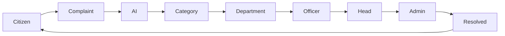

<div align="center">


# Civic Care

### 🚀 AI-Powered Smart Civic Issue Management Platform

<p align="center">
A next-generation civic complaint platform that uses AI to classify, prioritize,
and route public issues to the right government department within seconds.
</p>

<br>


<br><br>

> **"Building smarter cities with AI, automation and transparency."**

</div>

---

# ✨ Overview

Civic Care transforms the traditional complaint management system into an **AI-powered digital ecosystem** where citizens, field officers, department heads, and administrators collaborate through one intelligent platform.

Instead of waiting days for complaints to reach the correct department, Civic Care automatically analyzes, categorizes, prioritizes, and routes issues within seconds.

---

# 🎥 Project Preview

## 🌍 Landing Page

<p align="center">


</p>

---

## 🔐 Multi Role Authentication

<p align="center">


</p>

Supports

✅ Citizen

✅ Field Officer

✅ Department Head

✅ Administrator

---

## 📊 Citizen Dashboard

<p align="center">


</p>

Users can

- Track Complaints
- Submit New Reports
- Monitor Progress
- View Complaint Analytics

---

# ⚡ Why Civic Care?

Traditional systems are

❌ Slow

❌ Manual

❌ Paper Based

❌ Difficult to Track

❌ Poorly Organized

---

Civic Care introduces

✅ AI Classification

✅ Smart Routing

✅ Geo-tagged Complaints

✅ Real-time Tracking

✅ Department Workflow

✅ Role Based Access

---

# 🧠 AI Features

🧠 Complaint Classification

📍 Automatic Department Detection

⚡ Priority Prediction

📂 Intelligent Routing

📈 Real-time Monitoring

🔄 Status Tracking

---

# 🏛 System Architecture

```text
Citizen
    │
    ▼
Complaint Submission
    │
    ▼
AI Processing Engine
    │
 ┌──┼───────────────┐
 │  │               │
 ▼  ▼               ▼

Priority      Category      Location

      │
      ▼

Department Allocation

      │
      ▼

Field Officer

      │
      ▼

Department Head

      │
      ▼

Administrator

      │
      ▼

Citizen Notification
```

---

# 🔥 Core Features

| Feature | Description |
|----------|-------------|
| 🤖 AI Complaint Analysis | Automatically classifies complaints |
| 📍 Geo Location | GPS enabled reporting |
| 📸 Image Upload | Upload issue evidence |
| ⚡ Smart Routing | Sends issue to correct department |
| 👥 Multi User Roles | Citizen, Officer, Head, Admin |
| 📊 Dashboard | Live complaint statistics |
| 🔔 Notifications | Complaint status updates |
| 📈 Analytics | Department performance |

---

# 🛠 Technology Stack

<table>

<tr>

<td align="center">

### Frontend

HTML5

CSS3

JavaScript

</td>

<td align="center">

### Backend

Node.js

Express.js

REST API

</td>

<td align="center">

### Database

MongoDB

Mongoose

</td>

</tr>

</table>

---

# 📁 Folder Structure

```text
CIVIC CARE

├── Frontend
├── Backend
├── Controllers
├── Routes
├── Models
├── Middleware
├── Database
├── Assets
└── README.md
```

---

# 📈 Workflow



---

# 📊 Dashboard Features

✅ Complaint Timeline

✅ Status Analytics

✅ Issue Prioritization

✅ Department Allocation

✅ Complaint History

✅ Performance Monitoring

---

# 🚀 Installation

```bash
git clone https://github.com/dharunram-lgtm/civic-care.git

cd civic-care

npm install

npm start
```

---

# 🌎 Future Roadmap

- 🤖 Deep Learning Classification
- 🌍 GIS Map Integration
- 📱 Mobile Application
- 🔔 Push Notifications
- 📡 Live Officer Tracking
- 🛰 Satellite Location Detection
- 📈 Predictive Analytics
- ☁ Cloud Deployment
- 🧠 Generative AI Assistant

---

# 💎 Project Highlights

```
⚡ AI Powered

📍 Geo Tagged Complaints

🛠 Smart Department Routing

🔒 Secure Authentication

📊 Analytics Dashboard

🌙 Dark Modern UI

⚙ Responsive Design

🚀 High Performance

📱 Mobile Friendly

```

---

# 👨‍💻 Developed By

## Dharun Ram

GitHub

https://github.com/dharunram-lgtm

---

<div align="center">

# ⭐ If you like this project,

Give it a ⭐ on GitHub!

Made with ❤️ using Node.js • MongoDB • Express • JavaScript

</div>
